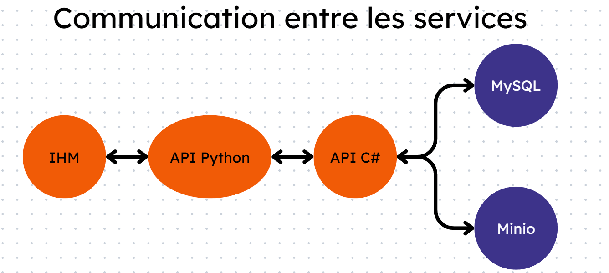

# Projet de Calcul et Stockage Distribué

## Description

Ce projet met en place une architecture distribuée composée de plusieurs conteneurs interagissant entre eux pour effectuer des calculs et stocker les résultats. L'objectif principal est d'envoyer un nombre via une interface web, de calculer certaines propriétés mathématiques sur ce nombre et de stocker les résultats dans une base de données MySQL et un stockage objet MinIO.

## Architecture

Le projet repose sur cinq conteneurs Docker :

- **ihm (PHP)** : Interface web permettant l'envoi d'un nombre.
- **calc (Python API)** : Effectue les calculs et transmet les résultats à int_db.
- **int_db (C# API)** : Interface avec la base de données MySQL et le stockage MinIO.
- **db (MySQL)** : Stocke les propriétés du nombre (pair/impair, premier, parfait).
- **minio (MinIO)** : Stocke la suite de Syracuse du nombre.

## Fonctionnement



1. **ihm** envoie un nombre à **calc**.
2. **calc** effectue les calculs suivants :
   - Détermine si le nombre est pair ou impair.
   - Vérifie s'il est un nombre premier.
   - Vérifie s'il est un nombre parfait.
   - Calcule la suite de Syracuse associée.
3. **calc** envoie les résultats à **int_db**.
4. **int_db** :
   - Stocke les informations *IsEven*, *IsPrime* et *IsPerfect* dans **MySQL**.
   - Stocke la suite de Syracuse dans **MinIO**.
5. **int_db** retourne la confirmation à **calc**.
6. **calc** renvoie la réponse à **ihm**.

## Technologies utilisées

- **Docker** : Conteneurisation des services.
- **PHP** : Interface utilisateur.
- **Python** : API pour les calculs.
- **C#** : API pour l'interaction avec la base de données et le stockage objet.
- **MySQL** : Base de données relationnelle.
- **MinIO** : Stockage objet.

## Installation

1. Cloner le projet :

   ```bash
    git clone https://github.com/ClaireVig249/AutomatisationClaireAntoine.git
    cd AutomatisationClaireAntoine
   ```

2. Construire et démarrer les conteneurs Docker :

   ```bash
    docker-compose up -d --build
   ```

3. Accéder à l'interface web via : `http://localhost:8080`

## API Endpoints

### **calc (Python)**

`http://localhost:8081`

- `POST /api/calcul`
  - Input : `{ "valeur": 7 }`
  - Output : `{ "message": "Données stockées avec succès", "result": { "number: 7, "isEven": true, "isPerfect": true, "syracuse": "1, 2, 3, 4, 5, 6, 7, 8, 9, 10" } }`

### **int_db (C#)**

`http://localhost:8082`

- `POST /api/process`
  - Input : `{ "Number": 7, "IsEven": false, "IsPrime": true, "IsPerfect": false, "Syracuse": "7, 22, 11, 34, 17, 52, 26, 13, 40, 20, 10, 5, 16, 8, 4, 2, 1" }`
  - Output : `{ "message": "Données stockées avec succès", "result": { "number": 7, "isEven": false, "isPrime": true, "isPerfect": false, "syracuse": "7, 22, 11, 34, 17, 52, 26, 13, 40, 20, 10, 5, 16, 8, 4, 2, 1" } }`
- `GET /api/process/datas`
  - Output : `{ "datas": [ { "id": 1 "number": 7, "isEven": false, "isPrime": true, "isPerfect": false } ] }`
- `GET /api/process/buckets`
  - Output : `{ "result": [ "syracuse 2025-02-06T14:25:02.578Z" ] }`
- `GET /api/process/object/syracuse`
  - Output : `{ "result": [ "syracuse-7.txt" ] }`

## Contributeurs

- [Claire Viguoine](https://github.com/ClaireVig249)
- [Antoine Coutreel](https://github.com/Antto0509)

## Licence

Ce projet est sous licence MIT.